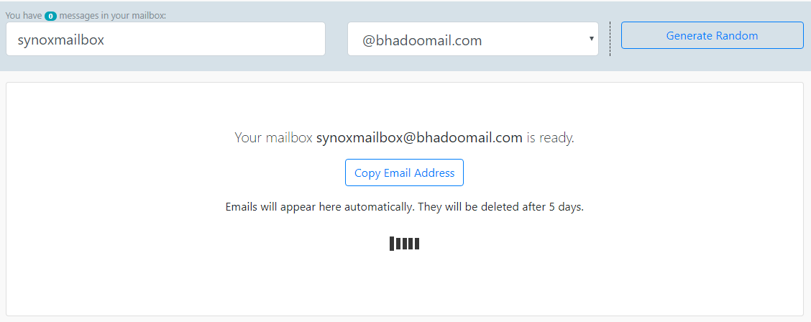

# self-hosted disposable email service

## Goals:
 * easy to use: generate random name or use custom name, auto refresh
 * easy to host: just php5 + imap extension
 * easy to install: just copy files in `dist`
 * minimal code base: minimal features and complexity

|         | 
| ------------- | 

## Quality/Status:
This is **alpha-tested** software, do not use it in production yes, it may lose your mails and people may gain access to your mails. There are still unsolved problems. Contributions are welcome!

## Licence
 disposable-mailbox by <a xmlns:cc="http://creativecommons.org/ns#" href="https://github.com/synox/disposable-mailbox" property="cc:attributionName" rel="cc:attributionURL">github:synox</a> is licensed under a <a rel="license" href="http://creativecommons.org/licenses/by-nc-sa/4.0/">Creative Commons Attribution-NonCommercial-ShareAlike 4.0 International License</a>.

## Webserver requirements

* php >=5.3.0
* [imap extension](http://php.net/manual/book.imap.php)
* apache 2 (but should work on any webserver)

## Installation

1. assure the [imap extension](http://php.net/manual/book.imap.php) is installed. The following command should not print any errors:

        <?php print imap_base64("SU1BUCBleHRlbnNpb24gc2VlbXMgdG8gYmUgaW5zdGFsbGVkLiA="); ?>

2. clone or download this repository
3. copy the `dist` directory to your web server.
4. rename `config.sample.php` to `config.php` and apply the imap settings. Move `config.php` to a safe location outside the `public_html`.
5. open `backend.php` and set the new path to `config.php`.

## Build it yourself
Instead of using the files in the `dist` directory you can also build it yourself. You must have [npm](https://docs.npmjs.com/cli/install) and [composer](https://getcomposer.org/download/) installed.

Install php dependecies:

    composer install

Install javascript dependencies:

    npm install

Build frontend:

    gulp build

The files are written to the `dist` directory.

There is a [Vagrantfile](Vagrantfile), in case you are familiar  with [vagrant](https://www.vagrantup.com/).

## TODO
 1. reduce total dist size (<1 MB)
 1. setup a link redirection provider (to keep the existence of your installation secret)
 1. maybe make mails collapsible
 1. provide error message if config.php is missing or in a public folder. 
 
## Credit

This could not be possible without...

 * http://angularjs.org/
 * https://github.com/SchweizerischeBundesbahnen/esta-webjs
 * https://github.com/barbushin/php-imap
